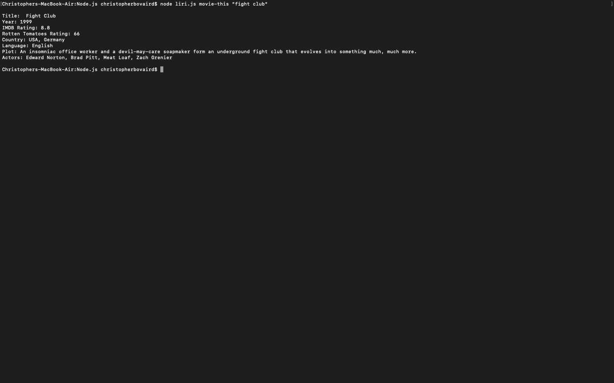
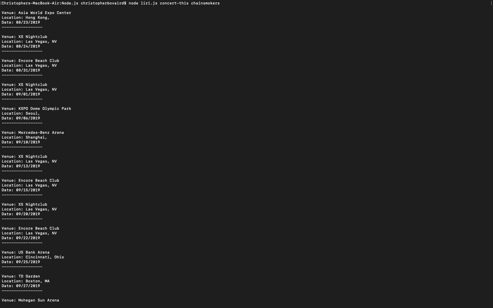

# LIRI
## A Language Recognition and Interpretation Interface

The purpose of this project was to create a Node application that takes in user input and returns specific information using API calls.

The user can use one of 4 commands: "movie-this", "concert-this", "spotify-this-song", or "do-what-it-says".

### movie-this
This command allows the user to enter a name of a movie and the application will return basic movie info from the OMBD API, such as realease date, actors that star in the movie, plot, rating, etc...

### concert-this
This command allows the user to enter the name of a specific music artist and then the application will return a list of upcoming concert shows by using the Bands-In-Town API, which will include the name of the venue, the date the location(city/state) of the venue. 

### spotify-this-song
This command allows the user to enter the name of a song and then then application will use the Spotify API to get the user a list of information about songs with that title, which will include the name of the song, the ablum it is from, and the artist(s) who perform the song.

